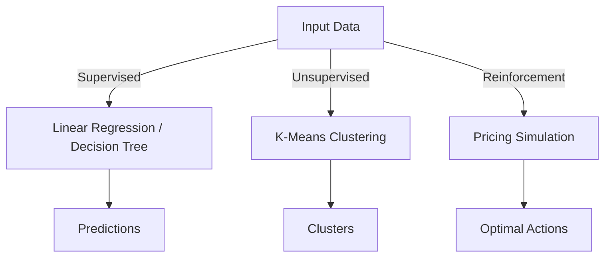

<h1>
  <span class="headline">Quick Refresher for ML</span>
  <span class="subhead">Algorithm Snapshots</span>
</h1>

**Time Required:** 25 minutes

## Learning Objectives
By the end of this lesson, you will be able to:
- Implement foundational machine learning algorithms across supervised, unsupervised, and reinforcement learning categories.
- Interpret the output of these algorithms and relate it to business decision-making.
- Build intuition for selecting the right algorithm based on the problem type.

## Introduction
Machine learning algorithms are the building blocks of AI solutions. Understanding their strengths, limitations, and outputs is critical for designing effective solutions. In this lesson, you will explore key algorithms from each category (supervised, unsupervised, reinforcement) and apply them to a small dataset representing customer behavior.

---

## Sample Dataset
We will work with a simple synthetic customer dataset that represents a subscription-based business:

```python
import pandas as pd

data = pd.DataFrame({
    'CustomerID': [1, 2, 3, 4, 5, 6, 7, 8, 9, 10],
    'Age': [23, 45, 31, 51, 29, 60, 33, 49, 28, 53],
    'MonthlySpend': [45, 120, 60, 200, 70, 300, 85, 180, 50, 250],
    'Churned': [0, 1, 0, 1, 0, 1, 0, 1, 0, 1]
})
```

## 1. Supervised Learning
### a. Linear Regression (Predicting Monthly Spend)
Linear regression predicts a continuous numeric value based on input features.

**Business Application Example:** Estimating a customer’s future monthly spend based on their age.

### Code Example:
```python
from sklearn.linear_model import LinearRegression

X = data[['Age']]
y = data['MonthlySpend']

model = LinearRegression()
model.fit(X, y)

prediction = model.predict([[35]])
print(f"Predicted Monthly Spend for Age 35: ${prediction[0]:.2f}")
```

### Key Takeaway:
Linear regression is most effective for numeric predictions when data has a linear relationship.

---

### b. Decision Tree Classifier (Predicting Churn)
Decision trees classify data based on a series of feature splits, making them intuitive and interpretable.

**Business Application Example:** Predicting whether a customer will churn based on age and monthly spend.

### Code Example:
```python
from sklearn.tree import DecisionTreeClassifier

X = data[['Age', 'MonthlySpend']]
y = data['Churned']

model = DecisionTreeClassifier()
model.fit(X, y)

prediction = model.predict([[35, 80]])
print(f"Predicted Churn (1=Yes, 0=No): {prediction[0]}")
```

### Key Takeaway:
Decision trees are flexible and interpretable but can overfit without proper tuning.

---

## 2. Unsupervised Learning
### a. K-Means Clustering (Customer Segmentation)
K-means clustering groups data points based on similarity, often used in customer segmentation.

**Business Application Example:** Grouping customers into segments for targeted marketing.

### Code Example:
```python
from sklearn.cluster import KMeans

X = data[['Age', 'MonthlySpend']]

model = KMeans(n_clusters=2, random_state=0)
model.fit(X)

data['Cluster'] = model.labels_
print(data[['CustomerID', 'Cluster']])
```

### Key Takeaway:
K-means is effective for segmenting data but requires choosing the right number of clusters.

---

## 3. Reinforcement Learning
### a. Pricing Optimization (Conceptual Example)
Reinforcement learning involves learning optimal actions through trial and error. Though complex in practice, simple reward-driven logic can demonstrate the core idea.

**Business Application Example:** Adjusting product pricing based on customer response.

### Conceptual Code Example (Pricing Simulation):
```python
price = 50
for day in range(10):
    sales = max(0, 10 - price // 10)
    revenue = price * sales
    print(f"Day {day + 1}: Price = {price}, Revenue = {revenue}")
    price += 5 if revenue < 300 else -5
```

### Key Takeaway:
Reinforcement learning is valuable for sequential decision-making but is often computationally intensive.

---

## Summary



## Practice
Experiment with the provided sample data:
1. Adjust the data to see how predictions change.
2. Modify the K-means cluster count and observe the segments.
3. Test different starting prices in the pricing simulation.

## Additional Resources
- [Scikit-Learn Documentation](https://scikit-learn.org/stable/)


