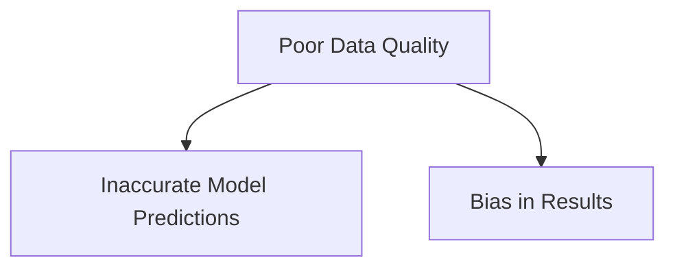

<h1>
  Quick Refresher for ML
  Key Limitations and Practical Challenges in Machine Learning
</h1>

**Time Required:** 10 minutes

## Learning Objectives
By the end of this lesson, you will be able to:
- Identify common limitations and challenges when working with machine learning models.
- Discuss the impact of these limitations on business decisions.
- Engage in a brief interactive reflection on how these challenges might apply to real-world scenarios.

## Prerequisites
- Completion of the Machine Learning Overview lesson.

## Introduction
Machine learning models can deliver powerful results, but they also come with important limitations and risks. Understanding these challenges is critical for building reliable and ethical AI solutions.

This brief lesson will highlight some of the most common issues and encourage you to reflect on how they could affect business outcomes.

## Common Limitations and Risks

### 1. Data Quality Issues
- **Garbage In, Garbage Out:** Models are only as good as the data they are trained on.
- **Incomplete or Biased Data:** Missing data or underrepresentation can lead to inaccurate or unfair predictions.

### 2. Interpretability
- **Black Box Models:** Complex models like neural networks can be difficult to interpret.
- **Trust and Adoption:** Business stakeholders may be hesitant to trust model outputs without understanding the underlying reasoning.

### 3. Ethical Concerns and Bias
- **Algorithmic Bias:** Models can perpetuate and amplify societal biases.
- **Fairness and Equity:** Discriminatory outcomes can harm certain groups and damage brand reputation.

### 4. Data Privacy and Security
- **Sensitive Data:** Personal and confidential information must be protected.
- **Compliance:** Regulatory frameworks like GDPR require responsible data practices.

## Reflection Exercise
You will be placed into breakout rooms in pairs. **Discuss the following questions with your partner**:
  - *Have you ever experienced or observed a flawed decision driven by poor data or technology?*
  - *Which of these limitations do you think would be most critical in your organization or industry?*

Be prepared to share a quick insight from your discussion when you return to the main room.

## Wrap-Up
Machine learning is not a perfect solution. Being aware of its limitations allows you to:
- Set realistic expectations.
- Make informed business decisions.
- Advocate for responsible and ethical AI practices.

