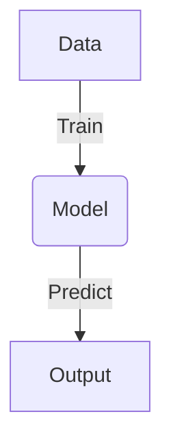
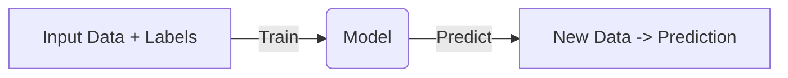
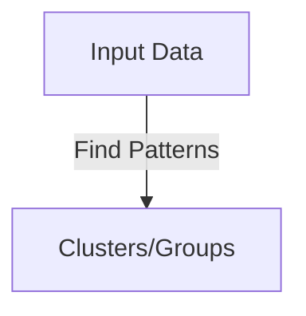
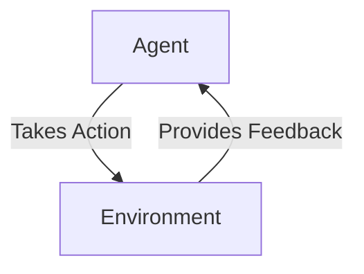

<h1>
  Quick Refresher for ML
  Machine Learning Overview
</h1>

Learning Objective
-------------------------
By the end of this lesson, you will be able to:
- Define machine learning.
- Explain the three primary types of machine learning: supervised, unsupervised, and reinforcement learning. 
- Understand their core distinctions and common business applications.

What is Machine Learning?
-------------------------

Machine learning (ML) is a subset of artificial intelligence (AI) that enables systems to learn from data and make predictions or decisions without being explicitly programmed. Instead of writing specific rules for every possible outcome, ML systems identify patterns in data to generate insights and automate decision-making.

✅ **Traditional programming**: Rules + Data → Output\
✅ **Machine learning**: Data + Output → Model (learned rules)

Types of Machine Learning
-------------------------

### 1\. Supervised Learning

-   The model is trained on labeled data, meaning the input data is paired with the correct output.
-   The goal is to learn a mapping from inputs to outputs, enabling the model to predict outcomes for new data.

**Common Algorithms:** Linear Regression, Decision Trees, XGBoost

**Business Applications:**

-   Predicting customer churn
-   Credit scoring
-   Demand forecasting
-   Email spam detection

**Key Distinction:** There is a clear, known outcome (labeled data).

* * * * *

### 2\. Unsupervised Learning

-   The model is trained on unlabeled data. It identifies patterns, groupings, or structures without knowing the correct outputs.

**Common Algorithms:** K-Means Clustering, Principal Component Analysis (PCA)

**Business Applications:**

-   Customer segmentation
-   Anomaly detection (e.g., fraud detection)
-   Market basket analysis (product recommendations based on purchase behavior)

**Key Distinction:** There is no predefined outcome; the goal is to uncover hidden patterns.

* * * * *

### 3\. Reinforcement Learning

-   The model learns through trial and error by interacting with an environment. It receives feedback in the form of rewards or penalties based on its actions.

**Common Algorithms:** Q-Learning, Policy-Based Methods

**Business Applications:**

-   Robotics (e.g., autonomous vehicles, warehouse automation)
-   Dynamic pricing
-   Recommendation systems that adapt based on user behavior
-   Game playing (e.g., AlphaGo)

**Key Distinction:** Learning occurs through actions and feedback from the environment, focusing on long-term rewards.

Summary Table
-------------

| Type | Data Input | Goal | Example Application |
| --- | --- | --- | --- |
| Supervised Learning | Labeled data | Predict known outcomes | Predicting loan defaults |
| Unsupervised Learning | Unlabeled data | Identify patterns or groupings | Customer segmentation |
| Reinforcement Learning | Environment feedback | Maximize cumulative reward over time | Optimizing supply chain logistics |

Key Takeaways for Business
--------------------------

-   **Supervised Learning:** Best when you need predictions and have historical data with known outcomes.
-   **Unsupervised Learning:** Useful when exploring data to discover hidden patterns or groupings.
-   **Reinforcement Learning:** Ideal when making sequential decisions in dynamic environments